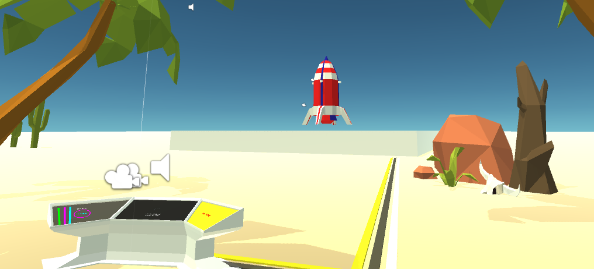

# RocketMan (A Virtual Reality Space Game, about [Insert Ideas Here])

## CONCEPT

**[Introduction]**
"RocketMan" (Placeholder name for the time being), is in very early-stage development and does not have a defined path of development at this point. Currently, development time is being spent implementing space-travel mechanics, VR spaceflight that has minimal nauseating effects, and brainstorming/hacking ideas for a semi-concrete development workflow.

While there are no specific plans for completing the game, there are a few decisions that had to be made before starting this journey. Firstly, in terms of platform, Google DayDream will be the main focus, while other platforms(e.g. Oculus Rift and HTC Vive) are on my list of technologies to expand into. Next, I wanted to decide on a foundational scope of the game(For the sanity of myself and others), which boiled down to: Space, Rockets, Multiplayer, Competitive, and Virtual Reality. This is, of course, EXTREMELY general, but there are handwritten notes and designs that are accompanying the flow of how this game progresses. As development continues, these guiding notes will become a part of the updates further down the page.

Check below for updates on the progress of development.

### UPDATES

**[Update 2017.1.29]**
Initial ReadMe creation, as well as first introduction as to the scope and purpose of this repository.

### WHY?

**[Skills Aiming To Improve]**
1. 3D Modeling
   * UV Texture Mapping/Unwrapping
   * Low-Poly Model Design and Creation
2. Unity Game Engine
   * Networking Mechanics
   * Virtual Reality Development
3. Game Development (In General)
   * Multiplayer
   * Stylized Design